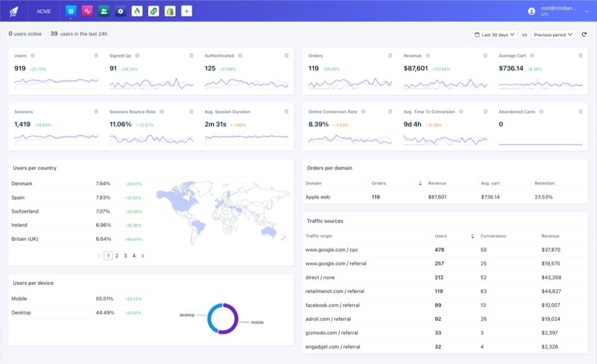

# Rimdian

## What is Rimdian?

Rimdian is a digital marketing platform to collect, unify, analyze & activate your customer data in real-time.

It is composed of a core platform that orchestrates all the data processing lifecycle, and apps that can hook into it, in order to import, enrich & activate data.

We can describe it as a “Composable Customer Data Platform”.
​

### For marketers

With the growing complexity of customer journeys, tracking issues & ever changing regulations, it becomes really difficult to get reliable insights from your data.

Rimdian will automate all of this for you:

- state-of-the-art tracking: cross-device / cross-channel / cross-domain (web-to-store…)
- user-identity resolution
- user segmentation
- multi-touch attribution for your marketing campaigns
- marketing automation

### For data scientists

With Rimdian, you won’t loose anymore time building data pipelines, ETL & reverse ETL jobs… thanks to the SingleStoreDB engine, the data is ready to be queried by your BI tools with SQL in live.

Want to take it to the next level? create your own app to customize the platform to your needs.

## Getting started

To get started with Rimdian, you can follow the [Documentation](https://docs.rimdian.com/)

## Open-source philosophy

By publishing the code of Rimdian, we want to show our commitment to transparency and allow any security researcher to audit our code.

We believe that the best way to build trust with our customers is to be open about the way Rimdian handles their data.

However our competitors are closed-source powerful companies driven by profit, and we need to protect our business from them. That's why our code is licensed under the [Elastic License 2.0](LICENSE.md).

### Contributing

Feel free to open Github issues to report bugs or suggest new features.

To avoid any intellectual property issues, we will not accept pull requests from external contributors.

For that reason we don't plan to provide any documentation about how to run the code locally. But we provide instructions to deploy the Docker images on your own infrastructure.

## Repository structure

This repository contains the source code to build the following components:

- the Data Collector
- the Server API
- the Console
- the JS SDK
